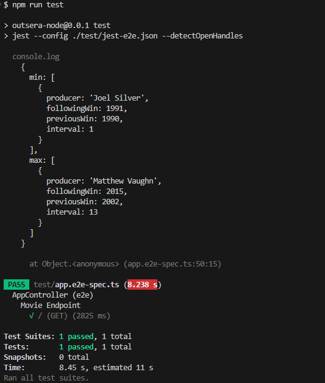
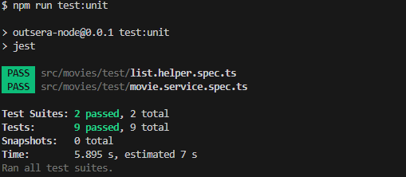

# Outsera Code test

### System Requirements: 
Read the CSV file of movies and insert the data into a database when the application starts.

### API Requirement: 
Get the producer with the longest interval between two consecutive awards and the one with the shortest time between two awards.

### Important
**The provided dataset does not contain two different producers who were winners. As such, with the provided dataset, the same producer will be shown as the winner for both the longest and shortest time intervals. To display different results, modify the `Movielist.csv` file in the `static` folder to include multiple winners with different intervals.**


## Project setup

```bash
$ npm install
```
## Run tests

The following tests return the dataset according to the system requirements.
To run the test, execute the following command:
```bash
$ npm run test
```
The test will be executed using `Jest`, showing the results based on the dataset provided at the beginning of the test.




The unit tests aim to validate the programming logic. To run them, use the following command:
```bash
npm run test:unit
```
The output will be:   


## API
As per the test requirements, only the endpoint for fetching results has been provided. No endpoints for adding, modifying, or deleting movies were included.  

To start the server, execute:
```bash
$ npm run start
```

By default, the application starts the server on port 3000.

To fetch the list of movies, send a `GET` request to the endpoint:
```bash
localhost:3000/movies
```

The result with the provided dataset will be:
```json
{
    "min": [
        {
            "producer": "Bo Derek",
            "followingWin": 1990,
            "previousWin": 1984,
            "interval": 6
        }
    ],
    "max": [
        {
            "producer": "Bo Derek",
            "followingWin": 1990,
            "previousWin": 1984,
            "interval": 6
        }
    ]
}
```

If needed, you can use the following CURL command for the request:
```bash
curl --location 'localhost:3000/movies'
```